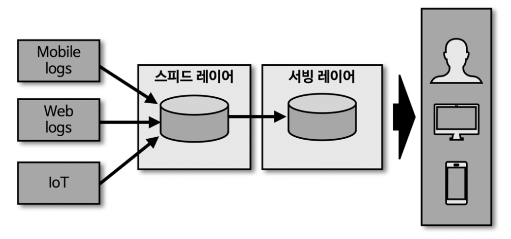

# 아파치 카프카의 역사와 미래

### 카프카의 탄생
***
### End-To-End 방식
- 서비스 간 의존성 증가
- 서비스 간 커플링 발생

***
### Apache Kafka 방식
- 서비스 간 의존성 감소
- 서비스 간 디커플링
- 중앙집중화

***
### 메세지 큐 구조 (FIFO)
- 프로듀서
  - 큐에 메세지 송신

- 컨슈머
  - 큐의 메세지 수신

***
### 빅데이터 파이프라인에 적합한 카프카의 특징
***
**1. 높은 처리량**
- 많은 양의 데이터를 묶어 배치로 빠르게 처리 가능
- 파티션 단위를 통해 동일 목적의 데이터를 여러 파티션에 분배, 데이터 병렬 처리 가능
- 파티션, 컨슈머 개수를 늘려서 데이터 처리량 늘릴 수 있음

**2. 확장성**
- 카프카 클러스터의 브로커를 최소한의 개수로 운영
- 데이터가 많아지면 브로커 개수를 자동으로 늘려서 Scale-Out
- 데이터가 적어지면 브로커 개수를 자동으로 줄여서 Scale-In
- 무중단으로 Scale-In/Out 가능

**3. 영속성**
- 데이터를 메모리에 저장하지 않고 파일시스템에 저장
- OS 레벨에서 파일 I/O 처리
- 파일 I/O 성능향상을 위해 페이지 캐시(page cache) 영역에 메모리 생성
- 한번 읽은 파일은 페이지 캐시 메모리에 저장 시켜서 다시 사용
- 브로커(카프카 서버) 장애 발생 하더라도 파일 시스템에 데이터가 존재하므로 안정적인 서비스 운영 가능

**4. 고가용성**
- 일부 서버에 장애 발생하더라도 무중단 처리
- 리더 브로커 - 팔로워 브로커 간 데이터 복제
- 리더 브로커 장애 발생 하더라도 팔로워 브로커에 데이터 복제 되어 있으므로 지속적인 서비스 운영 가능

***
### 스트림 데이터를 배치로 사용하는 방법 in Kafka

- 스트림 데이터에 timestamp 를 남긴다.
- 2022년 1월1일 부터 적재된 데이터를 구체화된 뷰로 가져와서 배치 처리 가능하게 한다.

***
### 스트리밍 데이터 레이크 방식 in Kafka

- 스피드 레이어(kafka) 를 통해 거대한 용량의 데이터를 오랜 기간 저장하고 사용

***
### 스트리밍 데이터 레이크 방식 사용 최적화 필요

- 자주 접근하는 데이터와 자주 접근하지 않는 데이터를 구분하는 작업이 필요
- 자주 접근하지 않는 데이터는 저렴하고 안전한 저장소에 별도 보관
- 그게 아니라면 카파 아키텍쳐로 서빙 레이어 별도 구현 필요

