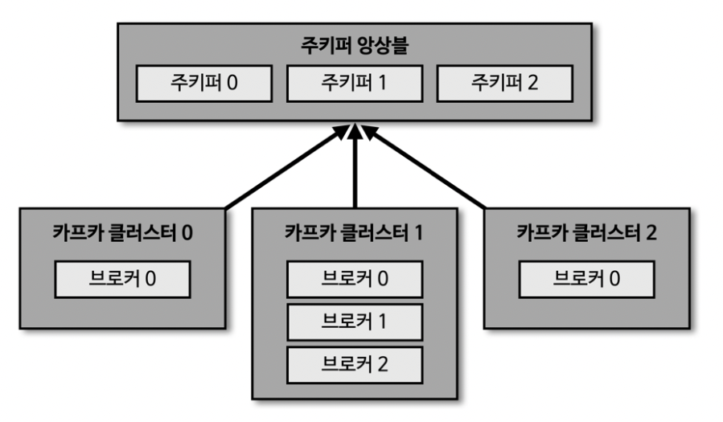

# 카프카의 기본 개념

### 카프카 생태계

- 프로듀서
  - 메세지 큐 송신

- MySQL, AWS S3
  - 소스 커넥트를 통해 메세지 큐 송신

- 카프카 클러스터
  - 카프카 브로커로 구축된 클러스터
  - 브로커 내부의 파티션에서 토픽 메세지 저장

- 컨슈머
  - 메세지 큐 수신

- JDBC, ElasticSearch
  - 싱크 커넥트를 통해 메세지 큐 수신

***
### 주키퍼(1) : 카프카 클러스터(1)

***
### 주키퍼(N) : 카프카 클러스터(N)

- 카프카 클러스터 실행하기 위해 주키퍼가 필요
  - 카프카 3.0 부터는 주키퍼가 없어도 클러스터 동작 가능
  - 하지만 안정성을 위해 주키퍼 사용 권장

***
### 브로커의 역할

**1. 컨트롤러**
- N개의 브로커 중 1개가 컨트롤러 역할
- 컨트롤러는 다른 브로커들의 상태를 체크
- 리더 파티션 장애 발생 시 리더 파티션 재분배
- 컨트롤러 역할 하는 브로커 장애 발생 시 다른 브로커가 자동으로 컨트롤러 역할 수행

**2. 데이터 삭제**
- 컨슈머나 프로듀서는 토픽의 데이터 수정/삭제 불가
- 브로커 만이 토픽의 데이터 삭제 가능
- 데이터 삭제는 파일 단위로 이루어지며, 이 단위롤 로그 세그먼트(log segment) 라고 칭함
- 파일 내부의 특정 레코드만 선별 삭제 불가

**3. 컨슈머 오프셋 저장**
- 컨슈머 그룹은 컨슈머가 파티션의 어느 위치의 레코드 까지 데이터를 수신 했는지 오프셋을 커밋
- 커밋한 오프셋은 __consumer_offsets 토픽에 저장해서 관리
- 여기에 저장된 오프셋을 토대로 컨슈머 그룹은 다음 레코드를 가져가서 처리

**4. 그룹 코디네이터**
- 컨슈머 그룹의 상태를 체크, 파티션을 컨슈머와 매칭되도록 분배하는 역할
- 파티션을 컨슈머와 재할당 하는 과정을 '리밸런스(rebalance)' 라고 칭함

**5. 데이터 저장, 삭제**
- config/server.properties의 log.dir 옵션에 정의한 디렉토리에 데이터 저장

  

- 로그와 세그먼트
  - log.segment.bytes: 바이트 단위의 최대 세그먼트 크기 지정, default : 1GB
  - log.roll.ms(hours) : 세그먼트가 신규 생성된 이후 다음 파일로 넘어가는 주기, default : 7일

  
- 액티브 세그먼트
  - 쓰기가 일어나고 있는 파일을 '액티브 세그먼트' 라고 칭함
  - 액티브 세그먼트는 삭제 대상에 포함되지 않음
  - 액티브 세그먼트가 아닌 세그먼트는 retention 옵션에 따라 삭제 대상- 

- 세그먼트 삭제주기(cleanup.policy=delete)
  - retention.ms(minutes, hours) : 세그먼트 보유 기간, default : 7일
  - retention.bytes : 파티션당 로그 적재 바이트 값, default : -1(지정안함)
  - log.retention.check.interval.ms : 세그먼트가 삭제 영역에 들어왔는지 확인 하는 간격, default : 5분

- 세그먼트 압축(cleanup.policy=compact)
  - 메세지 key 별로 오래된 데이터를 삭제하는 정책
  - delete 정책과 다르게 일부 레코드만 삭제 될 수 있음
  - 액티브 세그먼트가 아닌 세그먼트가 압축 대상
    
  

